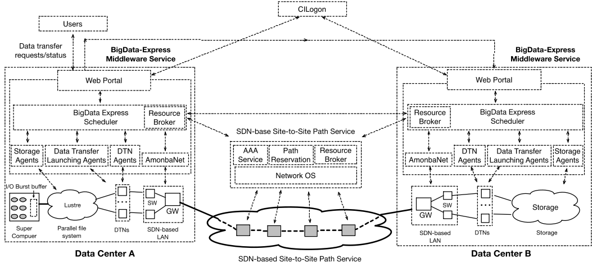
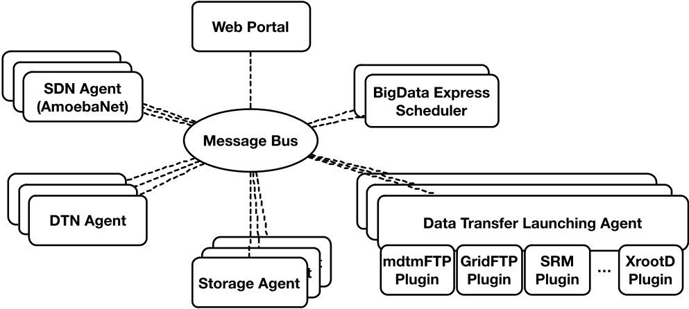
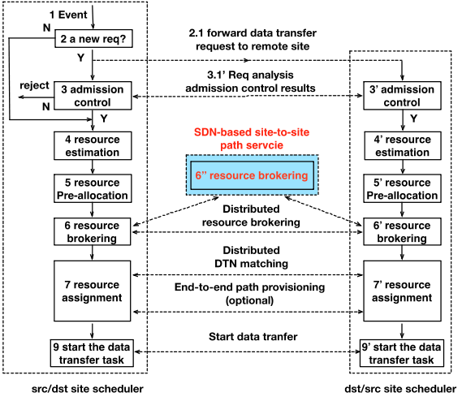
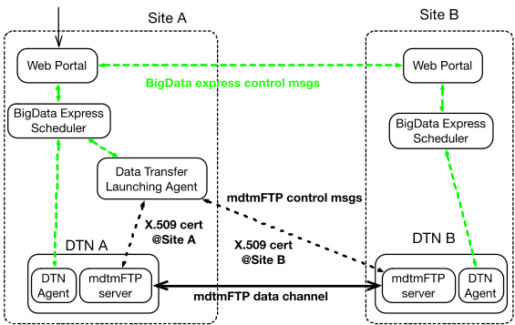
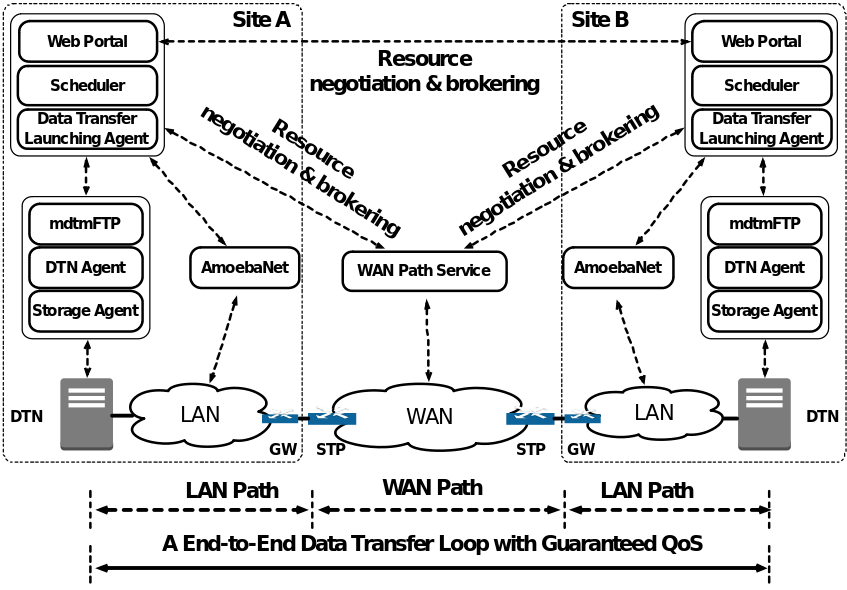

Design Notes
============

System design and architecture
------------------------------

BigData Express will typically run in a data center, such as a DOE
Leadership Computing Facility. As illustrated in Figure 1, a typical
site will feature a dedicated cluster of high-performance data
transfer nodes (DTNs,) an SDN-enabled LAN, and a large-scale storage
system.

* The dedicated DTNs are deployed using the Science DMZ
  architecture. A high-performance DTN is typically a NUMA-based
  multicore system with multiple NICs configured. Data transfer tool
  runs on each DTN. mdtmFTP is BigData Express’ default data transfer
  engine.

* The BigData-Express LAN is a network slice dedicated to the DTNs
  for bulk data transfer. It consists of either physical or
  virtualized SDN-enabled switches or routers connecting the local
  DTNs to a GW—a gateway router or switch that connects to external
  networks. Multiple GWs may exist for a large LAN.

* At large data centers, the storage system is typically a shared
  parallel file system (e.g., Lustre File System). All DTNs access
  this shared storage via a high bandwidth and well-connected
  Infiniband interconnect.

   Figure 1: BDE architecture

BigData Express optionally requires an on-demand site-to-site WAN
connection service to provide the path(s) between source and
destination sites. Normally, the WAN service supports guaranteed
bandwidth and designated time slot reservations. ESnet and Internet2
currently are capable of providing such a WAN service via OSCARs and
AL2S, respectively. This requirement is necessary for BigData Express
to establish end-to-end network paths with guaranteed QoS to support
real-time and deadline-bound data transfer. Otherwise, BigData Express
would provide best-effort data transfer.

BigData Express adopts a distributed, peer-to-peer model. A logically
centralized BigData Express scheduler coordinates all activities at
each BigData Express site. This BigData Express scheduler manages and
schedules local resources (DTNs, storage, and the BigData Express LAN)
through agents (DTN agents, storage agents, and AmoebaNet). Each type
of resource may require one or multiple agents. The scheduler
communicates with agents through a MQTT-based message bus (Figure
2). This architecture offers flexibility, robustness, and
scalability. BigData Express Schedulers located at different sites
negotiates and collaborates to execute data transfer tasks. They
execute a distributed rate-based resource brokering mechanism to
coordinate resource allocation across autonomous sites.

   Figure 2: A scalable system architecture.

Web Portal allows users and applications to access BigData Express
services. For a data transfer task, the following information will be
conveyed to BigData Express via Web Portal: the X.509 certificates of
the task submitter, the paths and filenames of the data source, the
paths of the data destination, the task deadline, and the QoS
requirements. BigData Express uses this information to schedule and
broker resources for the data transfer task, then launch data
transfers. Web portal also allows users to browse file folders, check
the data transfer status, or monitor the system/site status.

DTN agents collect and report the DTN configuration and status. They
also assign and configure DTNs for data transfer tasks as requested by
the BigData Express scheduler.

AmoebaNet keeps track of the BigData Express LAN topology and traffic
status with the aid of SDN controllers. As requested by the BigData
Express scheduler, AmoebaNet programs local networks at run-time to
provide custom network services.

Storage agents keep track of local storage systems usage, provide
information regarding storage resource availability and status to the
scheduler, and execute storage assignments.

Data Transfer Launching Agents initiate data transfer jobs as
requested by the BigData Express scheduler. Typically, Data Transfer
Launching Agents launch 3rd party data transfers between DTNs using
X.509 certificates on behalf of users. Data transfer launching agent
features an extensible plugin framework that is capable of supporting
different data transfer protocols, such as mdtmFTP, GridFTP, and
XrootD.

   Figure 3: scheduler operations.

The BigData Express scheduler implements a time-constraint-based
scheduling mechanism to schedule resources for data transfer
tasks. Each resource is estimated, calculated, and converted into a
rate that can be apportioned into data transfer tasks. The scheduler
assigns rates for data transfer tasks in the following order of
priority: real-time data transfer tasks -> deadline-bound data
transfer tasks -> background data transfer tasks. Rates will be
assigned to real-time data transfer tasks on an as-needed basis. The
scheduler schedules and assigns resources for data transfer tasks in
two modes: (a) in an event-driven mode, when a data transfer request
arrives, or a data transfer task is completed; and (b) in a periodic
mode to periodically reschedule and reassign resources for data
transfer tasks to adapt rapidly to changing run-time environments. For
extreme-scale data movement, a data transfer task may take days, or
even longer. Except for real-time data transfer tasks, it would be
naïve to make a one-shot reservation for a particular data transfer
task throughout its duration because run-time environments (e.g.,
traffic load, network, and storage conditions) will change with
time. Therefore, the scheduler runs in a periodic mode to reschedule
and reassign resources for a data transfer task as it progresses based
on the deadline and the remaining data size. On either an event-driven
or periodic basis, the scheduler performs the following tasks (Figure
3):

* Admission control. A data transfer job that cannot satisfy its time
  constraints without violating others will not be admitted.

* Resource estimation and calculation. Estimating and calculating the
  local site resources that can be assigned to data transfer tasks.

* Resource pre-allocation. Implementing a time-constraint-based
  resource allocation mechanism to pre-allocate the local site
  resources—in terms of rates—to data transfer tasks.

* Resource brokering. Implementing the resource brokering mechanism to
  coordinate rate pre-allocation across sites for a particular data
  transfer task, as well as determining the coordinated end-to-end
  data transfer rate for the task.

* Resource assignment. Assigning the local site resources to data
  transfer tasks based on their coordinated end-to-end data transfer
  rates, and establishing end-to-end paths between DTNs if required.

When the scheduler reshuffles resources for data transfer tasks,
deadline-bound and background data transfer tasks may be temporarily
suspended and then later resumed.

A BigData Express site can also allocate some resources to allow data
transfer with non-BigData Express sites, but in a best effort manner.

A High-performance Data Transfer Engine
---------------------------------------

mdtmFTP is BigData Express’ default data transfer engine. It offers
high-performance data transfer capabilities.

mdtmFTP achieves high performance through several key
mechanisms. First, mdtmFTP adopts a pipelined I/O centric design. A
data transfer task is carried out in a pipelined manner across
multiple cores. Dedicated I/O threads are spawned to perform network
and disk I/O operations in parallel. Second, mdtmFTP utilizes the MDTM
middleware services to make optimal use of the underlying multicore
system. Finally, mdtmFTP implements a large virtual file mechanism to
address the Lots of Small Files (LOSF) problem. Evaluations have shown
that mdtmFTP achieves higher performance than data transfer tools such
as GridFTP, FDT, and BBCP.

mdtmFTP supports third-party data transfer. It also supports GSI-based
security. Figure 4 illustrates a BigData Express data transfer
example. A Data Transfer Launching Agent launches a third-party data
transfer between two DTNs using X.509 certificates.

   Figure 4: BigData Express launches data transfer jobs.

On-Demand Provisioning of End-to-End Network Paths with Guaranteed QoS
----------------------------------------------------------------------

BigData Express intelligently programs network at run-time to suit
data transfer requirements. It dynamically provisions end-to-end
network paths with guaranteed QoS between DTNs. An end-to-end network
path typically consists of LAN and WAN segments. In BigData Express
end-to-end data transfer model, LAN segments are provisioned and
guaranteed by AmoebaNet, while WAN segments are provisioned through
on-demand WAN path services such as ESnet OSCARS, or Internet2 AL2S to
provide paths between the data source and destination sites.

AmoebaNet applies SDN technologies to provide “Application-aware”
network service services in the local network environment. It offers
several capabilities to support BigData Express operations. To support
network programmability, AmoebaNet provides a rich set of network
programming primitives to allow BigData Express to program the local
area network at run-time. To support QoS guarantees, AmoebaNet
provides two classes of services, priority and best-effort. Priority
traffic flows are typically specified with designated rates or
bandwidth. AmoebaNet uses QoS queues to differentiate priority and
best-effort traffic at each SDN switch. Priority traffic is
transmitted first, but metered to enforce rate control. In addition,
AmoebaNet supports QoS-based routing and path selection. Finally,
AmoebaNet supports fine-grained control of network traffic.

WAN QoS can be provisioned and guaranteed by utilizing ESnet OSCARS,
or Internet2 AL2S to reserve bandwidths between Service Termination
Points (STPs), where AmoebaNet services end.

Typically, AmoebaNet gateways (GWs) are either logically, or
physically connected to WAN STPs. VLAN popping, pushing, and/or
swapping operations are performed at AmoebaNet gateways to concatenate
WAN and LAN segments.

As illustrated in Figure 5, BigData Express typically performs the
following operations to provision an end-to-end network path:

#. Estimate and calculate the DTN-to-DTN traffic matrix, and the
   related QoS requirements (e.g. throughput, delay).

#. Negotiate and broker network resources to determine the end-to-end
   rate for the path.

#. Call ESnet OSCARS or Internet2 AL2S circuit service to set up a
   site-to-site WAN path.

#. Call AmoebaNet at each site to program and configure the LAN paths.

#. Send PING traffic to verify a contiguous end-to-end network path
   has been successfully established.

A large data transfer job typically involves many DTNs, and a
corresponding large number of data flows. To avoid the necessity of
establishing many WAN paths between the source and destination sites,
multiple LAN segments can be multiplexed/de-multiplexed to/from a
single WAN path, which in turn is configured to support the aggregated
bandwidth of its component paths. This strategy helps to reduce burden
on WAN path services.

   Figure 5: Provisioning of end-to-end path with guaranteed QoS.

Security
--------

BigData Express runs in secure environments. At each site, BigData
Express systems run in trusted security zones protected by security
appliances. All DTNs are secured by using X.509 certificates. All
BigData Express sits use a common single-point sign-on service
(CILogon) to obtain X.509 certificates for secure access to DTNs. In
addition, each site publishes its public key so that different sites
can establish trust. Communication channels between two sites are
secured by HTTPS.

Users are authenticated and authorized to access BigData Express
services. From a user’s perspective, BigData Express provides two
layers of security:

#. A user must first use his/her username and password to login to a
   particular BigData Express web portal. Once login is successful, a
   user can manage data transfer tasks (submission, cancellation, and
   monitoring), or monitor the system/site status.

#. Within a logged-in web portal, a user must further login to data
   transfer source and/or destination site(s) to obtain X.509
   certificates for secure access to local DTNs. Once authenticated
   locally, the user can browse files, and/or launch data transfer
   tasks. With CILogon issued X.509 certificates, the BigData Express
   scheduler will request Data Transfer Launching Agents to launch
   data transfer tasks on behalf of the user.

Error handling
--------------

Faults are inevitable in BigData Express due to the scale and
complexity of the system. BigData Express handles failures through
redundancy and retries. For critical components, multiple instances
will be launched to improve system reliability. A failed operation
will be retried multiple times until the maximum retry limit is
reached. When a failure can not be recovered, the event will be
recorded and system administrator will be alerted.

All transferred data will be checksummed and validated. Checksum
errors result in retransmission. Typically, a large data set is split
into multiple smaller blocks. Only the block(s) with errors are
retransferred.
