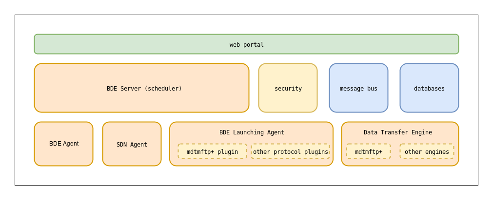
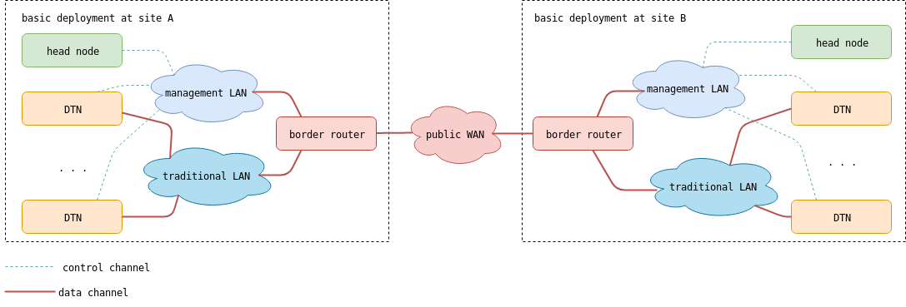
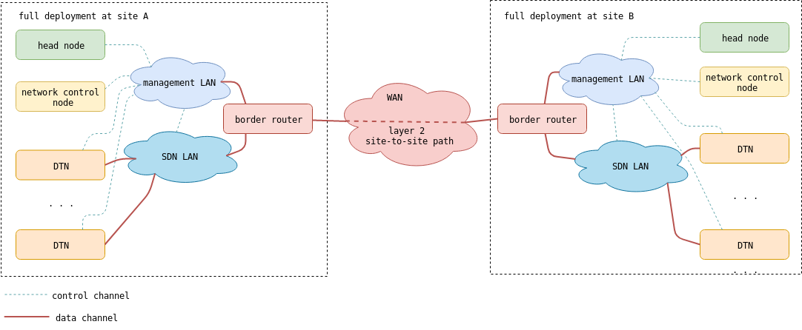

============
Introduction
============

What is BigData Express?
========================

BigData Express (BDE) is a software suite that provides schedulable,
predictable, and high-performance data transfer service in big data
and high-performance computing environments.

BDE's key features, among other things, are:

* An easy-to-use web portal.
* A high-performance data transfer engine.
* A time-constraint based scheduler.
* On-demand provisioning of end-to-end network paths with guaranteed
  QoS.
* Robust and flexible error handling.
* CILogon-based security.

Overview of BDE Services
========================

BDE will typically run in a data center. A typical site will feature a
dedicated cluster of high-performance data transfer nodes (DTNs), an
optional SDN-enabled LAN, and a large-scale storage system.

BDE optionally requires an on-demand site-to-site WAN connection
service to provide the path(s) between source and destination
sites. Normally, the WAN service supports guaranteed bandwdith and
designated time slot reservations. `ESnet`_ and `Internet2`_ currently
are capable of providing such a WAN service via `OSCARS`_, `SENSE`_,
and `AL2S`_ respectively. This requirement is ncessary for BDE to
establish end-to-end network paths with guaranteed QoS to support
real-time and deadline-bound data transfer. Otherwise, BDE would
provide best-effort data transfer.

.. _ESnet: https://www.es.net/
.. _Internet2: https://www.internet2.edu/
.. _OSCARS: https://www.es.net/engineering-services/oscars/
.. _SENSE: http://sense.es.net/
.. _AL2S: https://www.internet2.edu/products-services/advanced-networking/layer-2-services/

BDE adopts a distributed, peer-to-peer model. A logically centralized
BDE server (scheduler) coordinates all activities at each BDE
site. This BDE server manages and schedules local resources (DTNs,
storage, SDN LAN) through agents (DTN agents, and SDN agent i.e.,
`AmoebaNet`_). Each type of resrources may require one or multiple
agents. The scheduler communicates with agents through a MQTT-based
message bus. This architecture offers flexibility, robustnes, and
scalability. BDE servers located at differnt sites negotiate and
collaborate to execute data transfer tasks. They execute a distributed
rate-based resource brokering mechanism to coordinate resource
allocation across autonomous sites.

.. _AmoebaNet: https://bigdataexpress.fnal.gov/AmoebaNet.html

            **BigData Express software stack**

BDE software consists of several logical components, described below.

#. **Web portal**

   - A user interface for submitting data transfer requests, and
     monitoring job statuses.

   - HTTPS communication channels between BDE sites to support BDE
     mechanisms.

   - A mechanism for system administratrs to manage and monitor
     BDE sites.

#. **BDE server (scheduler)**

   - To orchestrate resources at local sites, including DTNs,
     Storage, and local network resources.

   - To megotiate and broker resources with remote sites.

#. **DTN Agents**

   - To collect and report the DTN configruation and status

   - To assign and cofigure DTNs for data transfer tasks as
     reqruested by the BDE scheduler

#. **SDN Agents (AmoebaNet)** (optional)

   - To keep track of the SDN LAN topology and traffic status.

   - To program local network at run-time to provide custom network
     service.

#. **Launching Agent**

   - To launch transfer jobs between DTNs as requested by the BDE
     server.

#. **Message bus**

   - To deliver commands and responses among various BDE components.

#. **Databases**

   - For persistence of data about users and ongoing and past data
     transfer tasks.

#. **Data transfer engine**

   - mdtmFTP is the default data transfer engine.  However BDE has an
     extensible plugin framework to support various data transfer
     tools.

In site deployment, these BDE components are typically hosted and deployed in three types of nodes:

- **Head node** typically runs:

  - Web portal
  - BDE server
  - MQTT message bus
  - MongoDB service
  - Data transfer launching agent
  - mdtmFTP client

- **DTN(s)** typically run:

  - DTN agent
  - mdtmFTP server

- **Network control node** runs:

  - ONOS
  - AmoebaNet

Typical BDE deployment options
==============================

BDE offers flexible deployment options for provisioning data transfer
services. The BDE components can be deployed, either in part or as a
whole, to support various types of data transfers, including real-time
data transfer, deadline-bound data transfer, and best-effort data
transfer.

Basic Deployment Configuration
------------------------------

            **BDE basic deployment**

..
   In a BDE deployment without an SDN, DTNs's data interfaces are
   connected to a high-performance data WAN.

Basic deployment configuration is recommended for a site with legacy
network infrastructure that does not support SDN.  In such an
environment, BigData Express can not program network at run-time to
establish network paths with guaranteed QoS to support
real-time and deadline-bound data transfer. However, BigData Express 
provides best-effort data transfer.

For basic deployment configuration, each site typically features a 
**head node** to host BigData Express service, and one or multiple
**DTNs** for data transfer.

Full Deployment Configuration
-----------------------------

            **BDE full deployment**

..
   In a BDE deployment with an SDN, we will have a **network control
   node** that runs AmoebaNet as an ONOS application, and an **SDN
   switch**.  We will use them to set up and tear down network paths as
   necessary.  Each DTN's data interface will use network paths set up by
   the SDN.

Full deployment configuration is recommended for a site with SDN network
infrastructure. In such an environment, BigData Express
can program networks at run-time to establish end-to-end network paths
with guaranteed QoS to support real-time and deadline-bound data
transfer.

For full deployment configuration, each site typically features a
**head node** to host BigData Express service, a **network control
node** to manage SDN networks, and one or multiple **DTNs** for data
transfer.

Hardware Requirements
=====================

BDE has been developed and tested on 64-bit Intel servers.

Head nodes can be a physical or virtual machine.  Head nodes can be
more "lightweight" than DTNs.

DTN machines are expected to be more powerful than head node, with
more CPU cores, more memory, faster network interfaces, and
larger/faster storage devices.

These are our recommendations:

- **Head node** could be a physical or virtual machine with:

  - CPU/cores: 4+.
  - RAM: 8GB+.
  - disk: 2GB+ free disk space.
  - NIC:

    - 1Gbps+, with a public IPv4 address and a valid DNS name.

- **DTN** are more powerful machines with:

  - CPU/cores: 4+.
  - RAM: 16GB+.
  - NIC for control plane:

    - 1Gpbs+ NIC, with a public IPv4 address and a valid DNS name

  - NIC for data plane:

    - 10Gbps+ NIC, with a private or public IPv4 address.

  - 2GB+ free disk space to install software.
  - high-performance SSD/disk for data transfer.

- **Network control node** is a physical or virtual machine with:

  - CPU/cores: 2+.
  - RAM: 8GB+.
  - disk: 2GB+ free disk space.
  - network:

    - 1Gbps+ NIC, with a public IPv4 address

- **SDN switch** (optional):

  - We support `Pika8 <https://www.pica8.com/>`_ switches running
    `ONOS <https://onosproject.org/>`_.

Supported Operating Systems
===========================

BDE software is developed and tested on servers running GNU/Linux
operating system.

BDE team at Fermilab has primarily used our home-grown distribution,
`Scientific Linux 7 <https://www.scientificlinux.org/>`_, for
developing and testing the software.  We also have deployments running
on CentOS 7, and Ubuntu server 16.04 and 18.04.  Other distributions
are largely untested at this time.

We would certainly be interested in making our software work in more
places.  Please talk to us if you need additional help or support, or
if you can help us!
