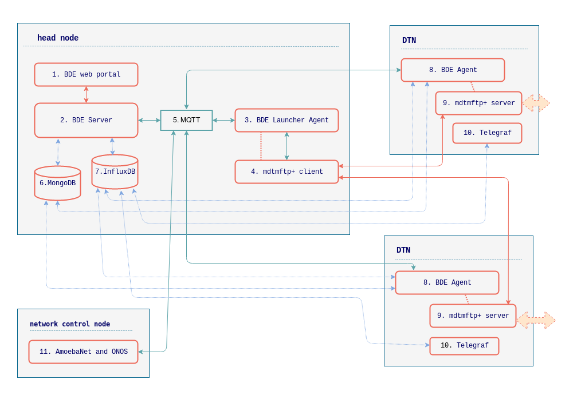

.. _set-up-bde-services:

=======================
Setting up BDE services
=======================

For **basic deployment configuration**, a BDE site should set up one
**head node** and one or multiple **Data Transfer Nodes (DTNs)**.

The deployment of **network control node** is optional. It is
recommended for a site with SDN infrastructure to support **full
deployment configuration**.

            **BigData Express deployment diagram - a logical overview**

At **Head Node**, it is recommended to install and run:

1. BDE web portal.

2. BDE Server, as ``bdeserver`` systemd service.

3. BDE Launching Agent, as ``bdelauncher`` systemd service.

4. BDE Launching Agent will launch and manage an mdtmftp+ client
   instance (``mdtm-ftp-client`` binary).  The client initiates and
   monitors third-party data transfer between mdtmftp+ server
   instances running on DTNs.

5. An `MQTT <https://mqtt.org/>`_ message bus service.  BDE uses
   `Eclipse Mosquitto <https://mosquitto.org/>`_.

6. A `MongoDB <https://www.mongodb.com/>`_ database, as persistent
   store for web portal user registrations, task states, etc.

7. An `InfluxDB <https://www.influxdata.com/>`_ database, for storing
   time-series data such as network and disk I/O rates.

At **DTN**, it is recommended to install and run:

8. BDE DTN Agent, as ``bdeagent`` systemd service.

9. BDE Data Transfer Engine, mdtmftp+ server (``mdtm-ftp-server``
   binary).

10. `Telegraf`_ agent, which will collect metrics from the DTN, and
    report them to InfluxDB.

.. _Telegraf: https://www.influxdata.com/time-series-platform/telegraf/

At **Network Control Node**, it is recommended to install and run:

11. AmoebaNet and ONOS.

Following sections discuss the software setup for head node and
DTN(s).

Steps to build BDE Server, BDE Agent, and mdtmftp+ software is common
to both **head node** and **DTNs**, which will be discussed first.

.. toctree::

   set-up-checklist.rst
   build-bde-software.rst
   set-up-head-node.rst
   set-up-dtn.rst
   set-up-firewall.rst
   set-up-test.rst
