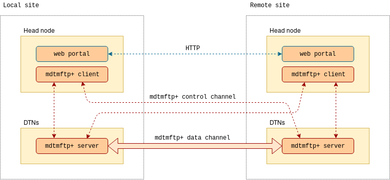

.. _set-up-test:

================
Check the wiring
================

We recommend the following checklist before launching a BDE site.

.. _set-up-test-within-site:

Within the site
===============

BDE components within a site should be able to reach each other,
so you will:

* Check head node services to make sure that they are running.
* Check that BDE services at head node are working as intended.
* Check that mdtmftp+ server's control port at each DTN is reachable from head node.
* Check that BDE Agent running on each DTN can reach BDE services at head node.

.. _set-up-test-head-node:

Check head node services
------------------------

First, check whether MQTT, MongoDB, and InfluxDB
services are running normally:

.. code-block:: console

   $ sudo systemctl status mosquitto.service mongodb.service influxdb.service

   ● mosquitto.service - LSB: mosquitto MQTT v3.1 message broker
      Loaded: loaded (/etc/init.d/mosquitto; generated)
      Active: active (running) since Mon 2019-06-24 17:32:23 EDT; 1 months 27 days ago
        Docs: man:systemd-sysv-generator(8)
       Tasks: 1 (limit: 4915)
      CGroup: /system.slice/mosquitto.service
              └─22607 /usr/sbin/mosquitto -c /etc/mosquitto/mosquitto.conf

   ● mongodb.service - An object/document-oriented database
      Loaded: loaded (/lib/systemd/system/mongodb.service; enabled; vendor preset: enabled)
      Active: active (running) since Thu 2019-05-09 16:23:51 EDT; 3 months 12 days ago
        Docs: man:mongod(1)
    Main PID: 27856 (mongod)
       Tasks: 40 (limit: 4915)
      CGroup: /system.slice/mongodb.service
              └─27856 /usr/bin/mongod --unixSocketPrefix=/run/mongodb --config /etc/mongodb.conf

   ● influxdb.service - InfluxDB is an open-source, distributed, time series database
      Loaded: loaded (/lib/systemd/system/influxdb.service; enabled; vendor preset: enabled)
      Active: active (running) since Fri 2019-05-17 11:24:11 EDT; 3 months 4 days ago
        Docs: man:influxd(1)
    Main PID: 18860 (influxd)
       Tasks: 15 (limit: 4915)
      CGroup: /system.slice/influxdb.service
              └─18860 /usr/bin/influxd -config /etc/influxdb/influxdb.conf

Then, check whether BDE software is up and running:

.. code-block:: console

   $ sudo systemctl status bdeserver.service bdelauncher.service bdeportal.service

   ● bdeserver.service - Bigdata Express Server/Scheduler
      Loaded: loaded (/lib/systemd/system/bdeserver.service; enabled; vendor preset: enabled)
      Active: active (running) since Wed 2019-07-17 11:57:51 EDT; 1 months 4 days ago
    Main PID: 19041 (bdeserver)
       Tasks: 13 (limit: 4915)
      CGroup: /system.slice/bdeserver.service
              └─19041 /usr/local/bin/bdeserver -d -c /usr/local/etc/bdeserver.json

   ● bdelauncher.service - Bigdata Express Launcher Agent
      Loaded: loaded (/lib/systemd/system/bdelauncher.service; enabled; vendor preset: enabled)
      Active: active (running) since Wed 2019-07-17 09:41:06 EDT; 1 months 4 days ago
    Main PID: 17395 (bdeagent)
       Tasks: 14 (limit: 4915)
      CGroup: /system.slice/bdelauncher.service
              ├─17395 /usr/local/bin/bdeagent -c /usr/local/etc/bdelauncher.json -l /tmp/bdelauncher.log
              └─17413 /usr/local/mdtmftp+/current/bin/mdtm-ftp-client -vb -p 16 -msgq localhost:1883:mdtm-listen-launcher:mdtm-report-launcher

   ● bdeportal.service - Bigdata Express Web Portal
      Loaded: loaded (/lib/systemd/system/bdeportal.service; enabled; vendor preset: enabled)
      Active: active (running) since Tue 2019-07-30 15:34:35 EDT; 3 weeks 1 days ago
    Main PID: 3643 (node)
       Tasks: 20 (limit: 4915)
      CGroup: /system.slice/bdeportal.service
              ├─3643 /usr/bin/node /srv/www/bdeportal/app.js --port 443
              └─3678 grunt

.. _set-up-test-mqtt-head-node:

Check MQTT on head node
------------------------

Please make sure that MQTT can route messages. 

First, start a subscriber:

.. code-block:: console

  $ mosquitto_sub -h localhost -p 8883 \
      --cafile /etc/ssl/mqtt-ca.crt -t test

Then, publish a message on ``test`` topic with ``mosquitto_pub``:

.. code-block:: console

  $ mosquitto_pub -h localhost -p 8883 \
      --cafile /etc/ssl/mqtt-ca.crt -t test -m "Hello world!"

The subscriber should print the message ``Hello world!`` on its
terminal.

.. note:: In the arguments to ``mosquitto_sub`` and ``mosquitto_pub``,
          change the port to 1883 and omit ``--cafile`` parameter if
          you have not enabled TLS in your Mosquitto server
          configuration.

.. _set-up-test-mongodb-head-node:

Check MongoDB on head node
--------------------------

Check that you can connect to MongoDB.  

If you have enabled BDE Agents on your DTNs, and if they have successfully 
registered themselves with BDE server, there should be corresponding records 
in a document named ``dtn``, in the ``bde`` database. 

.. code-block:: console

   $ mongo -u bde -p bde bde
   MongoDB shell version v4.0.12
   Enter password:
   connecting to: mongodb://127.0.0.1:27017/bde?gssapiServiceName=mongodb
   Implicit session: session { "id" : UUID("ff3eae54-abae-4055-a016-81633432f2bc") }
   MongoDB server version: 4.0.12
   Server has startup warnings:
   2019-08-20T08:46:58.110-0500 I STORAGE  [initandlisten]
   2019-08-20T08:46:58.110-0500 I STORAGE  [initandlisten] ** WARNING: Using the XFS filesystem is strongly recommended with the WiredTiger storage engine
   2019-08-20T08:46:58.110-0500 I STORAGE  [initandlisten] **          See http://dochub.mongodb.org/core/prodnotes-filesystem
   2019-08-20T08:46:59.995-0500 I CONTROL  [initandlisten]
   2019-08-20T08:46:59.995-0500 I CONTROL  [initandlisten] ** WARNING: Access control is not enabled for the database.
   2019-08-20T08:46:59.995-0500 I CONTROL  [initandlisten] **          Read and write access to data and configuration is unrestricted.
   2019-08-20T08:46:59.995-0500 I CONTROL  [initandlisten]
   ---
   Enable MongoDB's free cloud-based monitoring service, which will then receive and display
   metrics about your deployment (disk utilization, CPU, operation statistics, etc).

   The monitoring data will be available on a MongoDB website with a unique URL accessible to you
   and anyone you share the URL with. MongoDB may use this information to make product
   improvements and to suggest MongoDB products and deployment options to you.

   To enable free monitoring, run the following command: db.enableFreeMonitoring()
   To permanently disable this reminder, run the following command: db.disableFreeMonitoring()
   ---

   > db.dtn.find().pretty()
   {
   	"_id" : ObjectId("5d2e4e9290b7f15aff0faa2b"),
   	"ctrl_interface" : {
   		"ip" : "dtn-control-ip",
   		"name" : "eth0",
   		"rate" : 0
   	},
   	"data_folders" : [
   		"/data"
   	],
   	"data_interfaces" : [
   		{
   			"ip" : "dtn-data-ip",
   			"mac" : "dtn-data-hwaddr",
   			"name" : "eth1.1",
   			"rate" : 0,
   			"vlan_id" : 1
   		}
   	],
   	"data_transfer_program" : {
   		"env" : {
   			"GLOBUS_TCP_PORT_RANGE" : "32000,34640",
   			"GLOBUS_TCP_SOURCE_RANGE" : "54000,58000"
   		},
   		"path" : "/usr/local/mdtmftp+/current/sbin/mdtm-ftp-server",
   		"port" : 7001
   	},
   	"expire_at" : NumberLong("1563315978760"),
   	"id" : "00:00:00:00:00:00",
   	"name" : "your-dtn-name",
   	"queue_name" : "rpc/2DB5-D10B-E2B3-BA70",
   	"storage_interfaces" : null
   }
   >

.. _set-up-test-influxdb-head-node:

Check InfluxDB on head node
---------------------------

Check that you can connect to InfluxDB:

.. code-block:: console

   $ influx -host localhost -port 8086 -database bde
   Connected to http://localhost:8086 version 1.2.4
   InfluxDB shell version: 1.2.4
   > show databases
   name: databases
   name
   ----
   _internal
   bde
   telegraf
   bde_test

   > show series on bde
   [... a whole lot of output ...]

Check DTN control port from head node
-------------------------------------

If everything has been set up correctly, each of the DTNs will have an
``mdtm-ftp-server`` process listening on a control address,
typically on port 5001.  Check your BDE Agent configuration for the
actual port you are using.  Please make sure that the port
can be reached from head node.  You can use ``nc`` or ``telnet`` to
check that port.

If things works as expected, you should see the mdtmFTP greeting:

.. code-block:: console

   $ nc dtn1.your.site 5001
   220 dtn1.your.site mdtmFTP Server 1.1.0 (gcc64, 1556138254-10) [Globus Toolkit 5.2.5] ready.

.. _set-up-test-dtn-service:

Check DTN services
------------------

The ``bdeagent`` service should be running on each DTN:

.. code-block:: console

   $ sudo systemctl status bdeagent.service
   ● bdeagent.service - Bigdata Express Agent
      Loaded: loaded (/lib/systemd/system/bdeagent.service; enabled; vendor preset: enabled)
      Active: active (running) since Tue 2019-07-16 17:57:23 EDT; 1 months 5 days ago
    Main PID: 45986 (bdeagent)
       Tasks: 31 (limit: 7372)
      CGroup: /system.slice/bdeagent.service
              ├─45986 /usr/local/sbin/bdeagent -c /usr/local/etc/bdeagent.json -l /tmp/bdeagent.log
              └─46007 /usr/local/mdtmftp+/current/sbin/mdtm-ftp-server -control-interface 162.222.333.1 -data-interface 10.0.0.1 -p 5001 -password-file /etc/mdtm/password

   Jul 16 17:57:23 ott1.cenidtn.net systemd[1]: Started Bigdata Express Agent.

.. _set-up-test-dtn:

Check connectivity to head node from DTNs
-----------------------------------------

Check that the services running on head node are reachable from each of your DTNs. 

First, use `Netcat`_ to check that these ports on the head node are reachable:

* Port 1883 (or port 8883, if you have TLS/SSL enabled) for Mosquitto.
* Port 27017 for MongoDB.
* Port 8086 for InfluxDB.

.. _Netcat: https://en.wikipedia.org/wiki/Netcat

.. code-block:: console

   $ nc -v head.node 1883
   Connection to head.node 1883 port [tcp/*] succeeded!
   ^C
   $ nc -v head.node 27017
   Connection to head.node 27017 port [tcp/*] succeeded!
   ^C
   $ nc -v head.node 8086
   Connection to head.node 8086 port [tcp/*] succeeded!
   ^C

You can also use `nmap`_ to check remote ports:

.. _nmap: https://nmap.org/

.. code-block:: console

   $ nmap -Pn head.node -p 1883,27017,8086
   Starting Nmap 6.40 ( http://nmap.org ) at 2019-08-21 13:39 CDT
   Nmap scan report for head.node (1.2.3.4)
   Host is up (0.00015s latency).
   PORT      STATE SERVICE
   1883/tcp  open  unknown
   8086/tcp  open  d-s-n
   27017/tcp open  unknown

   Nmap done: 1 IP address (1 host up) scanned in 0.05 seconds

If the ports are not reachable, please check whether firewall is blocking traffic between head node and DTN, and routing is correctly configured, etc.

Optional: more checks for MQTT
-------------------------------

Start a subscriber on the head node:

.. code-block:: console

  $ mosquitto_sub -h localhost -p 8883 \
      --cafile /etc/ssl/mqtt-ca.crt -t test

Now try publishing a message from a DTN:

.. code-block:: console

  $ mosquitto_pub -h head.node -p 8883 \
      --cafile /etc/ssl/mqtt-ca.crt -t test -m "Hello world from DTN!"

Replace ``head.node`` with your head node's address.  If Mosquitto on
head node could route the message correctly, the subscriber should
print the message ``Hello world from DTN!`` on its output.

Note that you will have to install the clients on the DTN: they will
be in ``mosquitto`` package in RHEL, and ``mosquitto-clients`` package
in Ubuntu/Debian.

Optional: more checks for MongoDB
---------------------------------

Try to connect to MongoDB:

.. code-block:: console

   $ mongo --host head.node --port 27017 -u bde -p
   MongoDB shell version v4.0.12
   Enter password:
   connecting to: mongodb://head.node:27017/bde?gssapiServiceName=mongodb
   Implicit session: session { "id" : UUID("6cf98edf-51c0-4833-a1dc-8f45fb37efb9") }
   MongoDB server version: 4.0.12
   [...]

Optional: more checks for InfluxDB
-----------------------------------

InfluxDB exposes its API over HTTP.  You can use ``curl`` to run a
query from a DTN, and if it works, you should see an output similar to
the example below:

.. code-block:: console

   $ curl --get 'http://head.node:8086/query?pretty=true' \
      --data-urlencode "db=bde" --data-urlencode "q=SHOW MEASUREMENTS"
   {
       "results": [
           {
               "statement_id": 0,
               "series": [
                   {
                       "name": "measurements",
                       "columns": [
                           "name"
                       ],
                       "values": [
                           [
                               "disk_io"
                           ],
                           [
                               "disk_usage"
                           ],
                           [
                               "job"
                           ],
                           [
                               "jobs"
                           ],
                           [
                               "network"
                           ],
                           [
                               "site_txrx"
                           ],
                           [
                               "ssa"
                           ],
                           [
                               "sysinfo"
                           ],
                           [
                               "timing"
                           ]
                       ]
                   }
               ]
           }
       ]
   }

If ``curl`` is not available, you can use ``wget``, and that too
should print an output similar to that shown above.

.. code-block:: console

   $ wget "http://localhost:8086/query?pretty=true&db=bde&q=SHOW%20MEASUREMENTS" -O -

See InfluxDB docs on `Querying Data`_ and `Writing Data`_ if you are
curious about the protocol.

.. _Querying Data: https://docs.influxdata.com/influxdb/v1.2/guides/querying_data/
.. _Writing Data: https://docs.influxdata.com/influxdb/v1.2/guides/writing_data

.. _set-up-test-with-gsissh:

Verify trust paths using gsissh
-------------------------------

In :ref:`head-node-trust-path` and in :ref:`dtn-trust-path`, we
discussed installing certificates in your site's nodes. You can verify
if you have installed all the necessary certificates correctly by
using `GSI-enabled OpenSSH`_, also known as ``gsissh``.

.. _GSI-enabled OpenSSH: http://grid.ncsa.illinois.edu/ssh/

You will install gsissh server instances on each of the DTNs, and a
client on the head node, and then make sure you can connect to DTNs
from the head node without errors.

Follow the below steps:

1. Install gsissh server on the DTN:

   .. code-block:: console

      $ sudo yum install gsi-openssh-server

2. Change the default gsissh port

   With the default configuration in ``/etc/gsisshd/sshd_config``,
   gsissh will attempt to run on port 22, but it will likely conflict
   with any "regular" ssh services that we have on that port. Pleae
   change the default gsissh port:

   .. code-block:: console

      $ sudo vim /etc/gsisshd/sshd_config # Change port to 2202

3. On the DTN, start gsissh server in debug mode:

   .. code-block:: console

      $ sudo systemctl stop gsisshd
      $ sudo /usr/sbin/gsisshd -d

4. Install client on the head node:

   .. code-block:: console

      $ sudo yum install gsi-openssh-clients

5. Get a user certificate from `CILogon <https://cilogon.org/>`_, and
   install it in ``~/.globus/usercred.p12``.

   CILogon-issued certificates will have a subject like
   :cn:`/DC=org/DC=cilogon/C=US/O=Fermi National Accelerator
   Laboratory/OU=People/CN=BDE User/CN=UID:bdeuser`.  Note down the
   subject from CILogon website when you get the certficate. You will
   need that in step 6.

   Use ``chmod`` to protect it such that only you can read it:

   .. code-block:: console

      $ chmod 0600 ~/.globus/usercred.p12

   (For details, see CILogon FAQ entry: "`Can I download a CILogon
   certificate to my computer?
   <https://www.cilogon.org/faq#h.p_ID_106>`_".)

6. From ``~/.globus/usercred.p12``, you will have to create a
   password-free ``userkey.pem`` and ``usercert.pem``:

   .. code-block:: console

      $ cd ~/.globus
      $ openssl pkcs12 -in usercred.p12 -nokeys -out usercert.pem
      $ openssl pkcs12 -in usercred.p12 -nocerts -out userkey.pem
      $ chmod 0600 userkey.pem

   Enter password for ``~/.globus/usercred.p12`` when prompted.  The
   resulting key and certificate will not have a password.

7. On the DTN, edit ``/etc/grid-security/grid-mapfile``, so that there
   is a mapping between certificate's Common Name (CN) part and the
   local user.  You will basically need to add a line like below:

   .. code-block:: shell

      "/DC=org/DC=cilogon/C=US/O=Fermi National Accelerator Laboratory/OU=People/CN=BDE User/CN=UID:bdeuser" bde

   You can find the subject on your ``usercert.pem`` using an
   ``openssl`` command:

   .. code-block:: console

      $ openssl x509 -in ~/.globus/usercert.pem -noout -subject
      subject=DC = org, DC = cilogon, C = US, O = Fermi National Accelerator Laboratory, OU = People, CN = BDE User, CN = UID:bdeuser

8. From head node, try connecting to the server running on DTN:

   .. code-block:: console

      $ gsissh -p 2202 $USER@$DTN \
          -o PasswordAuthentication=no \
          -o PubkeyAuthentication=no \
          -o GSSAPIAuthentication=yes

Replace ``$USER`` and ``$DTN`` as appropriate.

If the above steps worked well, you had better get a shell on the DTN.
Otherwise, use the output of both the client and the server to figure
out what went wrong.

If things went well, and if you need gsissh again, you can enable and
start the service:

.. code-block:: console

  $ sudo systemctl enable gsisshd
  $ sudo systemctl start gsisshd

.. _set-up-test-local-remote:

Across sites
=============

Typically, a BDE site will federate with other sites to form a data transfer federation. Additionally, you need verification across sites to ensure:

* BDE web poral at your site can communicate with other portal(s) in the federation.

* BDE head node at your site can reach DTNs at other sites using mdtmFTP+ server's control port.

* DTNs at your site can be reached from head node(s) at other sites using mdtmFTP+ server's control port.

* DTNs across sites can communicate with each other using mdtmFTP+ server's data ports. 

Check remote web portal
-----------------------

Assuming that the remote site's web portal is at
``https://remote.site``, try doing this from the head node:

.. code-block:: console

   $ wget https://remote.site

That should not result in an error.

Check remote mdtmftp+ control port
----------------------------------

Assuming that the remote site's DTNs are ``dtn1.remote.site``,
``dtn2.remote.site``, and so on, your head node should be able to
reach control ports of the mdtmftp+ server instances in them.  You can
use ``nc``:

.. code-block:: console

   $ nc dtn1.remote.site 5001
   220 dtn1.remote.site mdtmFTP Server 1.1.0 (gcc64, 1556138254-10) [Globus Toolkit 5.2.5] ready.

   $ nc dtn2.remote.site 5001
   220 dtn2.remote.site mdtmFTP Server 1.1.0 (gcc64, 1556138254-10) [Globus Toolkit 5.2.5] ready.

.. _set-up-test-dtn-dtn:

Check that DTNs can talk to each other
--------------------------------------

During a data transfer job, mdtmftp+ server instances on both sending
and receiving sides will use a range of ports, in parallel, for the
purpose of maximizing throughput.  Therefore, generally speaking, it
is a good idea to allow all traffic between DTNs in your site and
those in remote sites.

If you *must* choose a port range in your firewall configuration,
check the BDE Agent configuration in each of your DTNs.  The values
set by ``GLOBUS_TCP_SOURCE`` and ``GLOBUS_TCP_PORT_RANGE`` will decide
the port ranges that you should allow.

.. code-block:: javascript

   {
      /* other global and module configuration items here */
      "data_transfer_program": {
        /* other mdtmftp+ server configuration items */
        "env": [
          { "GLOBUS_TCP_SOURCE_RANGE": "54000,64000" },
          { "GLOBUS_TCP_PORT_RANGE": "32000,34640" }
       ]
     }
   }

