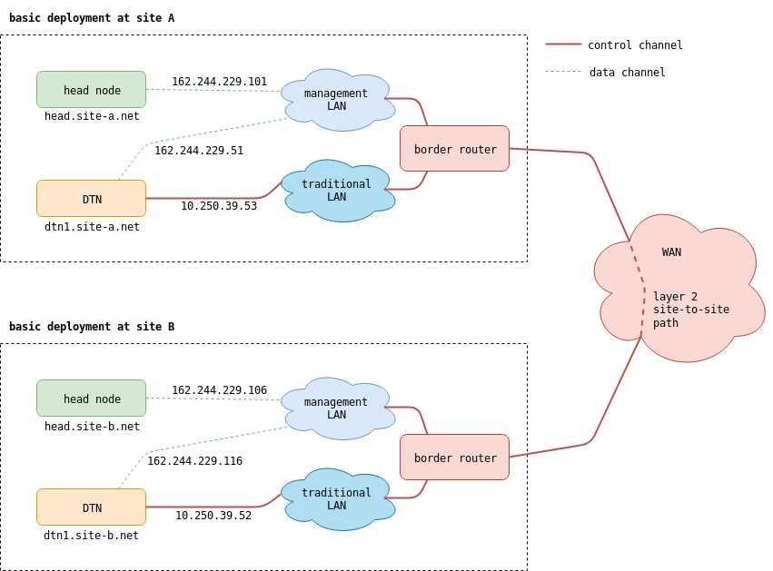

=====================
An Example Deployment
=====================

This section discusses a BDE deployment that has two sites, as shown
in the below the topology and tables.  Each site has one head node and
one DTN, and there's a WAN data path between the sites.

            A real BDE deployment

**Site A**

+-----------+-----------------+--------------------------+----------------------------+
| Role      | Host Name       | Control Plane NIC        | Data Plane NIC             |
+===========+=================+==========================+============================+
| Head Node | head.site-a.net | ens160 (162.244.229.101) | N/A                        |
+-----------+-----------------+--------------------------+----------------------------+
| DTN       | dtn1.site-a.net | enp9s0 (162.244.229.51)  | ens4f0.2039 (10.250.39.53) |
+-----------+-----------------+--------------------------+----------------------------+

**Site B**

+-----------+-----------------+--------------------------+----------------------------+
| Role      | Host Name       | Control Plane NIC        | Data Plane NIC             |
+===========+=================+==========================+============================+
| Head Node | head.site-b.net | ens160 (162.244.229.106) | N/A                        |
+-----------+-----------------+--------------------------+----------------------------+
| DTN       | dtn1.site-b.net | ens9s0 (162.244.229.116) | ens4f0.2039 (10.250.39.52) |
+-----------+-----------------+--------------------------+----------------------------+

BDE software configuration
==========================

The following subsections show configuration of BDE components,
specifically those in Site A.

Software running on the head node
---------------------------------

BDE Server
~~~~~~~~~~

BDE Server configuration is in ``/usr/local/etc/bdeserver.json``, and
it contains, among other things:

* Database and MQTT parameters.
* Launcher agent parameters.
* Highlighted section describes site network, with a static path that
  links this site to Site B.

.. literalinclude:: config-example-site/bdeserver.json
   :language: json
   :emphasize-lines: 24-35
   :linenos:

BDE Launcher Agent
~~~~~~~~~~~~~~~~~~

BDE Launcher configuration is in ``/usr/local/etc/bdeserver.json``,
and it describes:

* Database and MQTT parameters.
* Path to mdtmftp+ client, and its arguments.

.. literalinclude:: config-example-site/bdelauncher.json
   :language: json
   :linenos:

BDE web portal
~~~~~~~~~~~~~~

Web portal configuration is typically in the file ``config/local.js``,
under applicaton's root.  It describes:

* Path to SSL key and certificate.
* Local site's name.
* Head node's control interface.
* MQTT parameters.
* CILogon parameters.

.. literalinclude:: config-example-site/local.js
   :language: js
   :linenos:

Mosquitto MQTT broker
~~~~~~~~~~~~~~~~~~~~~

Mosquitto is running with its default configuration.

MongoDB server
~~~~~~~~~~~~~~

MongoDB is mostly running with default configuration, except that it
is also listening on an IP address that can be reached from DTNs.

.. code-block:: python
   :linenos:

   bind_ip = 127.0.0.1,162.244.229.101
   port = 27017

InfluxDB server
~~~~~~~~~~~~~~~

InfluxDB is running with its default configuration.

Software running on DTNs
------------------------

BDE Agent
~~~~~~~~~

BDE Agent configuration is in ``/usr/local/etc/bdeagent.json``, and it
contains:

* MQTT and database parameters
* Paths to helper programs
* Other agent parameters, including:

  * DTN's data and control interfaces
  * Data folders
  * Path to data transfer program (which is mdtmftp+ server, in this
    case) and its arguments and environment variables.
  * Flags for command and DTN registration handlers.

.. literalinclude:: config-example-site/bdeagent.json
   :language: json
   :linenos:

mdtmftp+ server
~~~~~~~~~~~~~~~

The mdtmftp+ server on ``dtn1.site-a.net`` use a couple of
configuration files.  One of them is a middleware configuration file,
``/etc/mdtm/mdtmconfig.xml``, which describes local network and
storage devices present in the DTN.

.. literalinclude:: config-example-site/mdtmconfig.xml
   :language: xml
   :linenos:

The file ``/etc/mdtm/server.conf`` file which specifies I/O behavior.

.. literalinclude:: config-example-site/server.conf
   :language: ini
   :linenos:
