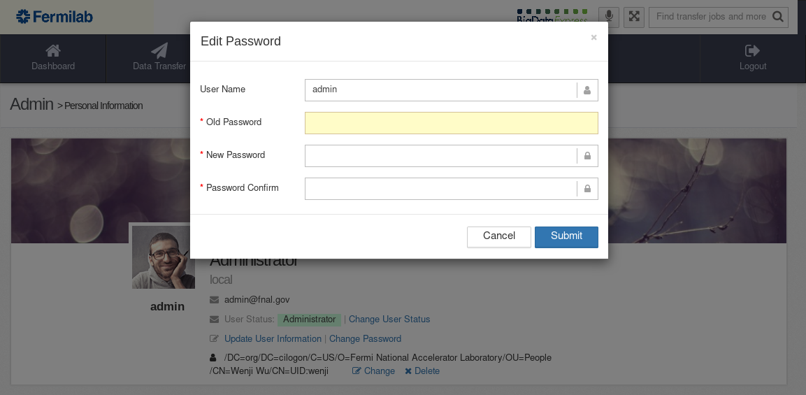
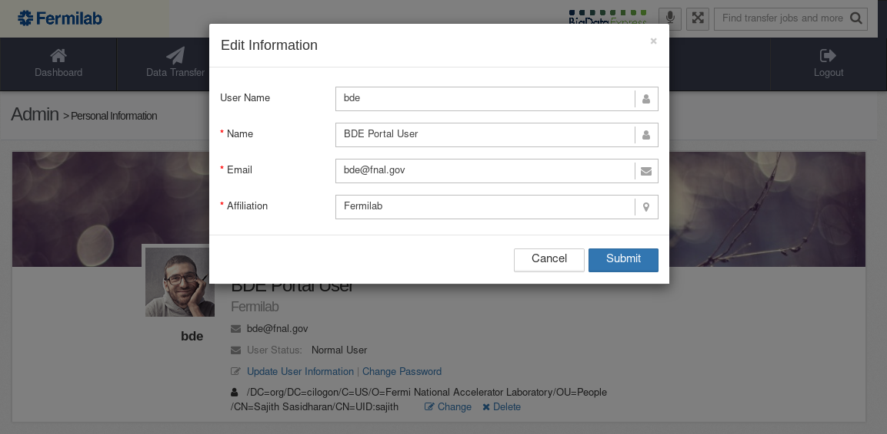

.. include:: roles.rst

.. _using-bde-web-portal-admin:

Using the portal as an admin
============================

First step as a new BDE portal admin
------------------------------------

At first login, please change the default password for the built-in ``admin`` account.

Go to :link:`Administration` ➝ :link:`User Information` ➝ :link:`Personal` ➝ :link:`Change Password`, Admin can update/change the built-in ``admin`` password.

BDE portal admin duties
-----------------------

BDE portal admin typically performs site administration tasks, which
include:

* User management

  * Adding/deleting user accounts
  * Approving/revoking user accounts
  * Update/change a user's information
  * Assign DTN(s) to a user

|

* Site management

  * List BDE site(s)
  * View a particular site's information

|

* Site status monitoring

  * View site toplogy
  * Monitor BDE server status
  * Monitor status of DTN(s)

User management
---------------

Go to :link:`Admistration` ➝ :link:`Users Management` ➝ :link:`List All Users` to find a list of all portal users.

Click on a particular username to visit the user's ``Personal
Information``, Admin can perform the following tasks:

* `Change an account's status`.  See
  :ref:`admin-change-account-status` for details.

* `Update account information`. See :ref:`admin-update-account-status`
  for details.

* `Change a user's password`. See :ref:`admin-change-password` for
  details.

* `Assign DTN(s) to users`. See :ref:`admin-associate-cn-ln` for
  details.

From the ``User List`` table, Admin can also delete accounts that are in
`revoked/declined` or `pending` status.  See
:ref:`admin-delete-account` for details.

.. _admin-change-account-status:

Changing account status
~~~~~~~~~~~~~~~~~~~~~~~

To change a particular account's status, visit the account's ``Personal
Information``.  Go to :link:`Administration` ➝ :link:`Users Management` ➝ :link:`List all Users`, and click on the username.  In ``Personal Information``, click
on :link:`Change User Status`.

The admin can switch a user account to one of the following statuses:

  * `Pending` status will switch an account back to the status before
    approval.
  * `Revoked/Decline` status will disable log ins.
  * `Normal` status is for regular users of the portal.
  * `Administrator` status is for users who are allowed to perform
    admin tasks, in addition to the built-in ``admin`` user.

.. image:: images/bde-portal-admin-change-user-status.png

Managing new accounts
~~~~~~~~~~~~~~~~~~~~~

Go to :link:`Administration` ➝ :link:`Users Management` ➝ :link:`Approve`, Admin can approve or reject pending user account requests.

.. image:: images/bde-portal-admin-approve-pending.png

Admin should also associate a new user's X.509 certificate's "Common
Name" (CN) with the local account(s) at designated DTN(s) so that the
user can access the DTN(s).  See the next section
(:ref:`admin-associate-cn-ln`) for details.

.. _admin-associate-cn-ln:

Assigning DTN(s) to a user
~~~~~~~~~~~~~~~~~~~~~~~~~~

Admin should associate a new user's X.509 certificate's "Common
Name" (CN) with the local account(s) at designated DTN(s) so that the
user can access the DTN(s).

User certificates issued by CILogon will have a CN that looks like
this:

:cn:`/DC=org/DC=cilogon/C=US/O=Fermi National Accelerator Laboratory/OU=People/CN=Sajith Sasidharan/CN=UID:sajith`.

In order to associate a user's CN with local user(s) at designiated
DTN(s), go to :link:`Administration` ➝ :link:`Users Management` ➝ :link:`List all Users`, and then click on the user name.

In the ``User Identify to DTN User Mapping`` table, choose a particular DTN, click on :link:`+Set`  to associate the user's CN with a local user name present in the DTN.

The admin can edit or delete this association later.

.. _admin-change-password:

Resetting account passwords
~~~~~~~~~~~~~~~~~~~~~~~~~~~

Go to :link:`Administration` ➝ :link:`Users Management` ➝ :link:`List all Users`, select a user, and then click on :link:`Change Password`, Admin can reset account password for the user.

Admin can also change account information by clicking on :link:`Update User Information`.

Manually creating a new account
~~~~~~~~~~~~~~~~~~~~~~~~~~~~~~~

Go to :link:`Administration` ➝ :link:`Users Management` ➝ :link:`Add New User`, Admin can create new accounts.

After a new account is entered, click on :link:`next` to proceed to the next screen. If input information is correct, click on :link:`finish` to complete the function.

After the account has been successfully created, admin should notify the user.

.. _admin-update-account-status:

Updating account information
~~~~~~~~~~~~~~~~~~~~~~~~~~~~

Admin can update account information on a user's behalf.  To do this,
visit the account's ``Personal information``.

Revoking accounts
~~~~~~~~~~~~~~~~~

Admin can revoke an active account.

Go to :link:`Administration` ➝ :link:`Users Management` ➝ :link:`List all Users`, choose the account to be revoked, click on :link:`Change User Status`, and change the
account status to ``Revoked/Pending``.

See :ref:`admin-change-account-status` for details.

.. _admin-delete-account:

Deleting accounts
~~~~~~~~~~~~~~~~~

Admin can delete accounts in revoked status.

Go to :link:`Administration` ➝ :link:`Users Management` ➝ :link:`List all Users`.  A :link:`delete` link will appear under the :link:`Actions` column for each account that is in revoked status.  Click on :link:`delete`, a confirmation dialog will pop up.

.. note:: Admin cannot delete accounts that are not in "revoked"
          status.  It aims to prevent accounts with ongoing data
          transfer tasks from being deleted.

Site management
---------------

Go to :link:`Site Info`, Admin can perform site status monitoring.

Site topology
~~~~~~~~~~~~~

Go to :link:`Site Info` ➝ :link:`Site Topology`, Admin can monitor a BDE site's topology and status.

Server status
~~~~~~~~~~~~~

Go to :link:`Site Info` ➝ :link:`Server Components and Status`, Admin
can monitor a BDE site's server status.

DTN status
~~~~~~~~~~

Go to :link:`Site Info` ➝ :link:`DTN and Storage Systems` to list all
DTNs currently registered in this site.  Click on a DTN to monitor its
status.

.. image:: images/bde-portal-admin-dtn-info.png

Listing federated sites
~~~~~~~~~~~~~~~~~~~~~~~

A BDE site is flexible to federate with other sites to form a data
transfer federation.

Go to :link:`Administration` ➝ :link:`Site Management` ➝ :link:`List All Sites` to list all sites in the federation that this site belongs to. Detailed information on each site is available.

