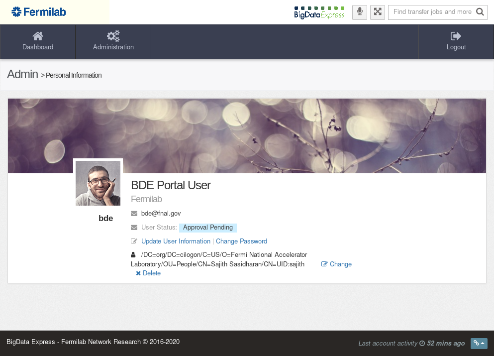

.. include:: roles.rst

.. _using-bde-portal-user:

Using the portal as a user
==========================

A user can submit and monitor data transfer jobs, and manage account.

Requesting a new web portal account
-----------------------------------

Step 1 - Register with a web portal

Click on :link:`Create Account` on the portal home page to
register a new account.

The user is not allowed to submit any data transfer jobs before the
account is approved by Admin.  However, the user can (and should)
log on to the web portal to update user information, and obtain the
user's certificate CN.

Later during the approval process, Admin will associate the user's CN with the local account(s) at designated DTN(s), so as to assign DTN(s) to the user.

Step 2 - Log on to the portal, using the registered username and password.

Step 3 - Obtain the user's certificate CN

Click on :link:`Administration` ➝ :link:`User information` ➝ :link:`Personal`  ➝ :link:`Associate to a certificate identify`. The browser will be redirected to CILogon.  The user is required to authenticate to his/her home
institution IDP to obtain certificate CN.  If successful, the personal
infromation page should display like:

Step 4 - Notify Admin to approve the account.

Managing data transfer jobs
---------------------------

Go to :link:`Data Transfer`, a user can submit new data
transfer jobs, monitor data transfer status and progress, and view job
history.

Submitting a new data transfer job
~~~~~~~~~~~~~~~~~~~~~~~~~~~~~~~~~~

Go to :link:`Data Transfer` ➝ :link:`Submit New Job`, a
user can submit a new data transfer job.

Step 1: Click on :link:`Change site` in the ``FROM`` box to choose a
source site from the resulting pop-up list.

Step 2: Log on to the source site, browse and select files to be
transferred

Step 3: Click on :link:`Change site` in the ``TO`` box to choose a
destination site from the pop-up list.

Step 4: Log on to the destination site, and select a data transfer
destination folder.

Step 5. In the ``Job Requirements`` box, enter a label for the data
transfer job, an email for notification when it is finished, and click
on :link:`Submit Job` to start the job.

Monitoring ongoing jobs
~~~~~~~~~~~~~~~~~~~~~~~

A user's ongoing jobs are all summarized in :link:`Dashboard`.

Or, go to :link:`Data Transfer` ➝ :link:`View Current Jobs`, click on a job for details.

Listing past jobs
~~~~~~~~~~~~~~~~~

Go to :link:`Data Transfer` ➝ :link:`View Past Jobs` to list all past
jobs. Click on a particular job for details.

.. image:: images/bde-portal-past-jobs.png

.. _account-management:

Account management
------------------

Go to :link:`Administration` ➝ :link:`User information` ➝ :link:`Personal`, a user can manage his/her account.

Changing password
~~~~~~~~~~~~~~~~~

Go to :link:`Administration` ➝ :link:`User information` ➝ :link:`Personal` (see :ref:`account-management`), and click on :link:`Change Password`, a user can change password.

In case a user forgets his/her password, the user should contact Admin for a new password.

Change certificate CN
~~~~~~~~~~~~~~~~~~~~~

Go to :link:`Administration` ➝ :link:`User information` ➝ :link:`Personal`. 

Click on :link:`Change`, a user can change his/her current CN to a different one. 

Click on :link:`Delete`, a user can delete his/her current CN.

Update account information
~~~~~~~~~~~~~~~~~~~~~~~~~~

Go to :link:`Administration` ➝ :link:`User information` ➝ :link:`Personal` (see :ref:`account-management`), and further click on :link:`Update User Information`, a user can update account information.

.. image:: images/bde-portal-user-update-info.png
